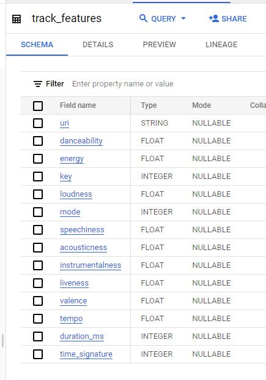
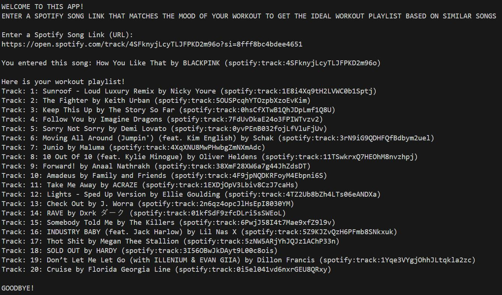
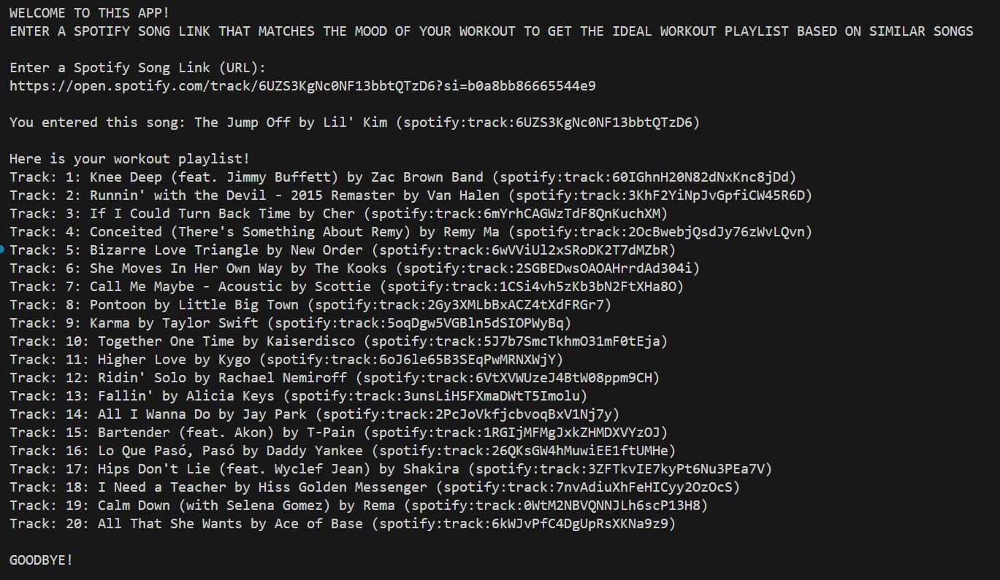

# Creating a Mood-based Workout Playlist (Spotify)

### Background

As per a [CDC’s website](https://www.cdc.gov/physicalactivity/basics/adults/index.htm#:~:text=Physical%20activity%20is%20anything%20that,Physical%20Activity%20Guidelines%20for%20Americans.), “each week adults need 150 minutes of moderate-intensity physical activity and 2 days of muscle strengthening activity”. Workouts often incorporate music and evidence shows “incorporating personal choice in selecting music increases performance” ([Source](https://www.ncbi.nlm.nih.gov/pmc/articles/PMC8167645/)). Spotify is the world’s top streaming company, but with [over 100 million tracks](https://newsroom.spotify.com/company-info/), how can a user quickly choose songs to work out to. 

### Objective

The goal of this project will be to provide a tool and framework to generate a **simple workout playlist** of 20 songs based on 1 user-selected song that best describes the user’s intended workout mood.

### App Description
* This simple app takes in a Spotify Song Link (URL) that best describes what mood the user is into and outputs a playlist of 20 workout songs
* There are ~5K song candidates extracted from Spotify's API from all playlists listed as [Popular Workout Playlists](https://open.spotify.com/genre/section0JQ5IMCbQBLsb9HwPKg2Us) 
* Song features for candidates are loaded in a BigQuery table to be manually refreshed periodically
* Song recommendations are based on content-based filtering. 
* Songs in Bigquery are extracted and each song is given a similarity score to input song via cosine distance.
* The songs most similar to song selected are printed.

### Data Warehouse
The data for all song candidates is generatated via the python script `source_tracks.py` and saved in a BigQuery table.

### User Behavior (via Command Line Interface)
* Data In: Spotify Song Link (URL)
* Data Out: 20 Similar Spotify songs

**Demo 1: "How You Like That" by Blackpink**

**Demo 2: "The Jumpoff" by Lil' Kim**

### Dashboard

An exploration of Spotify's workout songs extracted for this project can be found in [this dashboard](https://lookerstudio.google.com/reporting/8b9af529-8207-443b-887e-e5cfb696315f). 

### Tech Tools
* Spotify API, via Spotipy Python library
* BigQuery, via google.cloud Python library and BigQuery console
* SKLearn's Cosine Similarity, via sklearn.metrics.pairwise library
* Additional Python Libraries: Pandas, Re (Regex), OS

### Next Steps

This is an MVP project. It's basic structure including selection of data tools is effectively implemented. Below are some possible improvements:
* Create a UI
* Dynamically generate workout playlist uris via web parsing
* Partition BQ table by date to save past versions of song candidates
* Move to cloud
* Outputs to user song url instead of song uri